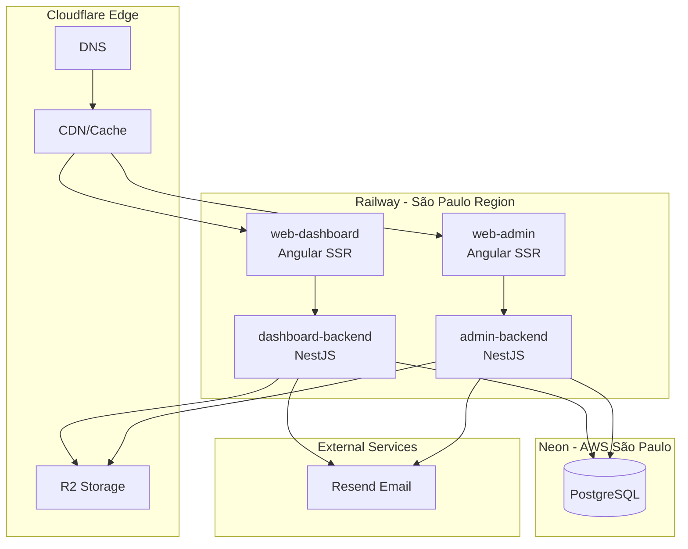

# Cloud Deployment Strategy for Skooltrak Platform

## Recommended Stack: Railway + Neon + Cloudflare

Given your requirements (moderate budget, medium scale, balanced complexity, LATAM region), this stack offers the best balance:



## Infrastructure Components

### 1. Compute: Railway ($20-80/month)

- **Why Railway**: Native Bun support, Nx monorepo support, São Paulo region, simple deployments
- **Services**: 4 services from single repository
- **Scaling**: Horizontal auto-scaling available

### 2. Database: Neon PostgreSQL (Free tier or $19/month Pro)

- **Why Neon**: Serverless PostgreSQL, AWS São Paulo region, connection pooling built-in, branching for staging
- **Alternative**: Railway PostgreSQL (simpler but less features)

### 3. Storage: Cloudflare R2 (Already configured)

- Keep existing R2 setup - S3-compatible, generous free tier

### 4. CDN/DNS: Cloudflare (Free tier)

- Edge caching for static assets
- DNS management
- DDoS protection

---

## Project Structure Changes

### Add Dockerfiles

Create `apps/dashboard-backend/Dockerfile`:

```dockerfile
FROM oven/bun:1 AS builder
WORKDIR /app
COPY package.json bun.lock ./
COPY prisma ./prisma
RUN bun install --frozen-lockfile
COPY . .
RUN bun nx build dashboard-backend --configuration=production
RUN bun nx run dashboard-backend:prune

FROM oven/bun:1-slim
WORKDIR /app
COPY --from=builder /app/dist/apps/dashboard-backend .
COPY --from=builder /app/generated ./generated
COPY --from=builder /app/prisma ./prisma
RUN bun install --production
EXPOSE 3000
CMD ["bun", "run", "main.js"]
```

Similar Dockerfiles for `admin-backend`, `web-dashboard`, and `web-admin` (SSR builds).

### Add railway.json (monorepo config)

```json
{
  "$schema": "https://railway.com/railway.schema.json",
  "build": { "builder": "DOCKERFILE" },
  "deploy": { "restartPolicyType": "ON_FAILURE" }
}
```

---

## Environment Variables (Railway)

Configure these in Railway dashboard per service:

| Variable                          | Description                                           |
| --------------------------------- | ----------------------------------------------------- |
| `DATABASE_URL`                    | Neon connection string (with `?sslmode=require`)      |
| `BETTER_AUTH_SECRET`              | Auth secret (generate with `openssl rand -base64 32`) |
| `JWT_SECRET`                      | JWT secret                                            |
| `APP_URL`                         | Public URL (e.g., `https://app.skooltrak.com`)        |
| `CLOUDFLARE_R2_ENDPOINT`          | R2 endpoint                                           |
| `CLOUDFLARE_R2_ACCESS_KEY_ID`     | R2 access key                                         |
| `CLOUDFLARE_R2_SECRET_ACCESS_KEY` | R2 secret                                             |
| `CLOUDFLARE_R2_BUCKET`            | R2 bucket name                                        |
| `RESEND_API_KEY`                  | Resend API key                                        |
| `EMAIL_FROM`                      | From email address                                    |

---

## Domain Structure

```
skooltrak.com                  → web-dashboard (main app)
admin.skooltrak.com            → web-admin
api.skooltrak.com              → dashboard-backend
api-admin.skooltrak.com        → admin-backend
```

---

## CI/CD Pipeline

Update `[.gitlab-ci.yml](.gitlab-ci.yml)` to add deployment:

```yaml
stages:
  - test
  - build
  - deploy

test:
  # existing test job

deploy:
  stage: deploy
  only:
    - main
  script:
    - curl -fsSL https://railway.app/install.sh | sh
    - railway up --service dashboard-backend
    - railway up --service admin-backend
    - railway up --service web-dashboard
    - railway up --service web-admin
```

---

## Migration Strategy

### Phase 1: Database Setup

1. Create Neon project in AWS São Paulo region
2. Run `npx prisma migrate deploy` to apply migrations
3. Run `bun prisma/scripts/seed-admin.ts` to seed initial data

### Phase 2: Backend Deployment

1. Create Railway project with 4 services
2. Configure environment variables
3. Deploy `dashboard-backend` and `admin-backend`
4. Verify GraphQL endpoints work

### Phase 3: Frontend Deployment

1. Update API URLs in frontend configs (or use Railway's internal networking)
2. Deploy `web-dashboard` and `web-admin`
3. Configure custom domains in Railway

### Phase 4: DNS & CDN

1. Point domains to Railway via Cloudflare
2. Enable Cloudflare proxy for caching
3. Configure SSL (automatic with Railway + Cloudflare)

---

## Cost Estimate (Monthly)

| Service               | Cost                        |
| --------------------- | --------------------------- |
| Railway (4 services)  | $20-80                      |
| Neon PostgreSQL (Pro) | $19                         |
| Cloudflare R2         | ~$5 (usage-based)           |
| Cloudflare CDN        | Free                        |
| Resend                | Free tier (3k emails/month) |
| **Total**             | **$44-104/month**           |

---

## Alternative: Fly.io + Supabase

If you prefer more control or need better LATAM performance:

- **Fly.io**: Containers in São Paulo (GRU), more granular scaling
- **Supabase**: Managed PostgreSQL with real-time capabilities, South America region
- Similar pricing, slightly more complex setup

---

## Key Files to Create/Modify

1. `apps/dashboard-backend/Dockerfile` - Backend container
2. `apps/admin-backend/Dockerfile` - Admin backend container
3. `apps/web-dashboard/Dockerfile` - SSR frontend container
4. `apps/web-admin/Dockerfile` - Admin SSR frontend container
5. `railway.json` - Railway monorepo configuration
6. `.gitlab-ci.yml` - Add deployment stage
7. Update CORS origins in backends for production domains
