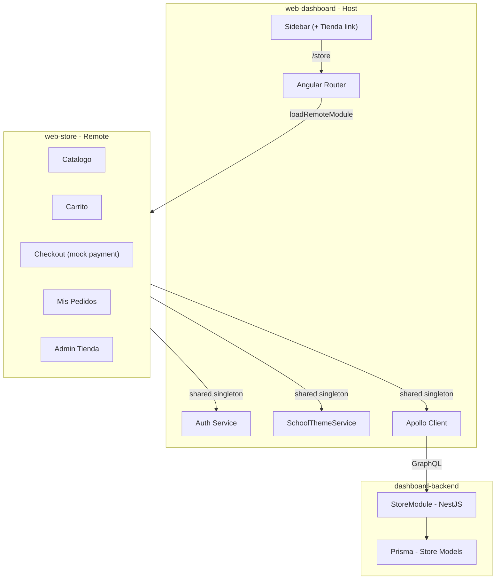

# School Online Store (Tienda Escolar)

## Architecture Overview



The store is a **separate Angular app** (`web-store`) loaded at runtime into the dashboard shell via `@angular-architects/native-federation`. It shares Angular core, Apollo, auth, and theme as singletons so the store inherits the school branding and user session automatically.

---

## Phase 1: Infrastructure -- Native Federation Setup

### 1a. Install Native Federation

```bash
bun add @angular-architects/native-federation
```

### 1b. Scaffold the `web-store` remote app

Use `nx g @nx/angular:application web-store` to create a new Angular app under `apps/web-store/`. Configure it with:

- No SSR (keep it simple for the remote -- SSR can be added later)
- Same Tailwind / DaisyUI styling as the dashboard
- Same `proxy.conf.json` pointing `/api` to the backend

### 1c. Configure federation

**Host** (`[apps/web-dashboard/federation.config.js](apps/web-dashboard/federation.config.js)`):

- Declare `web-store` as a remote
- Share Angular core, router, common, Apollo, `@/auth`, `@/ui`, `@/shared` as singletons

**Remote** (`[apps/web-store/federation.config.js](apps/web-store/federation.config.js)`):

- Expose `./routes` from `apps/web-store/src/app/store.routes.ts`
- Same shared config as host

Update `[apps/web-dashboard/project.json](apps/web-dashboard/project.json)` build executor to use `@angular-architects/native-federation:build` (wraps the esbuild application builder).

---

## Phase 2: Database and Backend

### 2a. Prisma Models

Add to `[prisma/schema.prisma](prisma/schema.prisma)`:

- `**StoreCategory` -- `id`, `schoolId` (FK School), `name`, `description?`, `sortOrder`, `active`, `createdAt`, `updatedAt`
- `**StoreProduct` -- `id`, `schoolId` (FK School), `categoryId?` (FK StoreCategory), `name`, `description?`, `price` (Decimal), `imageUrl?`, `stock` (Int), `active`, `createdAt`, `updatedAt`
- `**StoreCartItem` -- `id`, `userId` (FK User), `productId` (FK StoreProduct), `quantity`, `createdAt`, `updatedAt`; unique on `[userId, productId]`
- `**StoreOrder` -- `id`, `schoolId` (FK School), `userId` (FK User), `total` (Decimal), `status` (enum: PENDING/CONFIRMED/PROCESSING/READY/DELIVERED/CANCELLED), `paymentStatus` (enum: PENDING/PAID/FAILED/REFUNDED), `notes?`, `createdAt`, `updatedAt`
- `**StoreOrderItem` -- `id`, `orderId` (FK StoreOrder), `productId` (FK StoreProduct), `quantity`, `unitPrice` (Decimal)

Add reverse relations on `School` and `User` models.

### 2b. Permissions

Add to `[libs/auth/src/lib/permissions/permissions.constants.ts](libs/auth/src/lib/permissions/permissions.constants.ts)`:

- `MANAGE_STORE` -- for admins to manage products/categories/orders
- `VIEW_STORE` -- for all members to browse and purchase

Grant `VIEW_STORE` to all default roles (STUDENT, TEACHER, PARENT). Grant `MANAGE_STORE` to ORG_ADMIN.

### 2c. NestJS Store Module

Create under `[apps/dashboard-backend/src/app/store/](apps/dashboard-backend/src/app/store/)`:

**Entities** (GraphQL ObjectTypes):

- `StoreProduct`, `StoreCategory`, `StoreCartItem`, `StoreOrder`, `StoreOrderItem`

**DTOs** (InputTypes):

- `CreateProductInput`, `UpdateProductInput`, `CreateCategoryInput`, `UpdateCategoryInput`, `AddToCartInput`, `UpdateCartItemInput`, `CreateOrderInput`

**Service** (`store.service.ts`):

- Product CRUD (scoped to school)
- Category CRUD (scoped to school)
- Cart management: `addToCart`, `updateCartItem`, `removeCartItem`, `getCart`, `clearCart`
- Order flow: `createOrder` (validates stock, deducts inventory, clears cart), `getOrders`, `getOrderById`, `updateOrderStatus`
- Mock payment: `processPayment` (simulates success/failure after a delay)

**Resolver** (`store.resolver.ts`):

- Queries: `storeProducts(schoolId)`, `storeProduct(id)`, `storeCategories(schoolId)`, `myCart(schoolId)`, `myOrders(schoolId)`, `storeOrders(schoolId)` (admin), `storeOrder(id)`
- Mutations: `createStoreProduct`, `updateStoreProduct`, `deleteStoreProduct`, `createStoreCategory`, `updateStoreCategory`, `deleteStoreCategory`, `addToCart`, `updateCartItem`, `removeFromCart`, `clearCart`, `checkout`, `processPayment` (mock), `updateStoreOrderStatus`
- Guards: `BetterAuthGuard` + `PermissionsGuard`; `VIEW_STORE` for browsing/purchasing, `MANAGE_STORE` for admin operations

Register `StoreModule` in `[apps/dashboard-backend/src/app/app.module.ts](apps/dashboard-backend/src/app/app.module.ts)`.

---

## Phase 3: Frontend -- Store Browsing and Cart

### 3a. GraphQL Operations

Create `apps/web-store/src/app/graphql/operations/store.graphql` with all store queries and mutations. Run `graphql:generate` to produce typed operations.

### 3b. Store Pages

All pages are standalone components with `OnPush` change detection, using signals and `rxResource` for data fetching (matching existing patterns).

| Route                           | Component               | Description                                                                  |
| ------------------------------- | ----------------------- | ---------------------------------------------------------------------------- |
| `/store`                        | `catalog.ts`            | Product grid with category filter chips, search input, school-scoped         |
| `/store/product/:id`            | `product-detail.ts`     | Product image, description, price, stock status, "Agregar al carrito" button |
| `/store/cart`                   | `cart.ts`               | Cart items table, quantity +/-, remove, subtotal/total, "Proceder al pago"   |
| `/store/checkout`               | `checkout.ts`           | Summary, mock billing form, "Pagar" button triggering mock payment           |
| `/store/order-confirmation/:id` | `order-confirmation.ts` | Success page with order number, details                                      |
| `/store/orders`                 | `orders.ts`             | User's order history list                                                    |
| `/store/orders/:id`             | `order-detail.ts`       | Single order status and items                                                |

### 3c. Cart Service

`cart.service.ts` -- Injectable root service using signals:

- `cartItems: Signal<CartItem[]>` -- fetched via GraphQL `myCart`
- `cartCount: Signal<number>` -- computed from items
- `cartTotal: Signal<number>` -- computed sum
- Methods: `addToCart()`, `updateQuantity()`, `removeItem()`, `clearCart()`

The cart badge count will display in the sidebar link.

---

## Phase 4: Frontend -- Store Admin

Accessible only to users with `MANAGE_STORE` permission.

| Route                            | Component         | Description                                                                                              |
| -------------------------------- | ----------------- | -------------------------------------------------------------------------------------------------------- |
| `/store/admin`                   | `store-admin.ts`  | Admin shell with horizontal tabs (like existing `[admin.ts](apps/web-dashboard/src/app/admin/admin.ts)`) |
| `/store/admin/products`          | `products.ts`     | Product table with create/edit/delete, stock and active toggles                                          |
| `/store/admin/products/new`      | `product-form.ts` | Product create form (name, description, price, category, stock, image)                                   |
| `/store/admin/products/:id/edit` | `product-form.ts` | Product edit form (reused component)                                                                     |
| `/store/admin/categories`        | `categories.ts`   | Category CRUD table with inline editing                                                                  |
| `/store/admin/orders`            | `orders-admin.ts` | All school orders, status management, filters                                                            |

---

## Phase 5: Dashboard Integration

### 5a. Sidebar Link

Add a "Tienda" link in `[apps/web-dashboard/src/app/core/sidebar.ts](apps/web-dashboard/src/app/core/sidebar.ts)` in the General section (after "Grupos" or similar), visible to all authenticated users. Include cart badge count:

```html
<li>
  <a
    routerLink="store"
    routerLinkActive="bg-primary/10 text-primary font-semibold"
    class="flex items-center gap-3 px-3 py-2 ..."
  >
    <span class="material-symbols-outlined text-xl">storefront</span>
    <span>Tienda</span>
    @if (cartCount() > 0) {
    <span class="badge badge-primary badge-sm ml-auto">{{ cartCount() }}</span>
    }
  </a>
</li>
```

### 5b. Dashboard Route

Add to `[apps/web-dashboard/src/app/app.routes.ts](apps/web-dashboard/src/app/app.routes.ts)` (inside the dashboard children):

```typescript
{
  path: 'store',
  loadChildren: () => loadRemoteModule('web-store', './routes')
    .then(m => m.STORE_ROUTES),
}
```

### 5c. Theme Sharing

No extra work needed -- because the remote runs inside the host's Angular platform:

- `SchoolThemeService` CSS variables on `:root` apply to all DOM including remote components
- DaisyUI `data-theme` attribute (light/dark) is on `document.documentElement`
- The store uses the same Tailwind/DaisyUI utility classes (`btn-primary`, `bg-base-100`, etc.)

---

## Key Files to Create/Modify

**New files:**

- `apps/web-store/` -- entire new Angular app (~20 component files)
- `apps/web-store/federation.config.js`
- `apps/dashboard-backend/src/app/store/` -- NestJS module (~12 files)

**Modified files:**

- `[prisma/schema.prisma](prisma/schema.prisma)` -- add 5 models + 2 enums + School/User relations
- `[apps/web-dashboard/federation.config.js](apps/web-dashboard/federation.config.js)` -- new file, host config
- `[apps/web-dashboard/project.json](apps/web-dashboard/project.json)` -- update build executor for NF
- `[apps/web-dashboard/src/app/app.routes.ts](apps/web-dashboard/src/app/app.routes.ts)` -- add `/store` route
- `[apps/web-dashboard/src/app/core/sidebar.ts](apps/web-dashboard/src/app/core/sidebar.ts)` -- add Tienda link
- `[apps/dashboard-backend/src/app/app.module.ts](apps/dashboard-backend/src/app/app.module.ts)` -- register StoreModule
- `[libs/auth/src/lib/permissions/permissions.constants.ts](libs/auth/src/lib/permissions/permissions.constants.ts)` -- add store permissions
