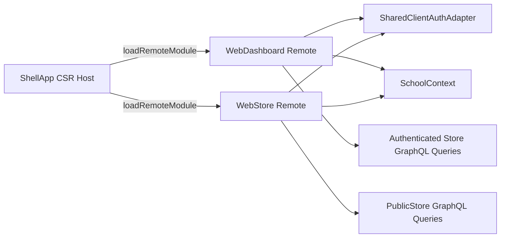

# Shell Federation Refactor

## Target architecture

The new shell becomes the only federation host. `web-dashboard` stops hosting `web-store` and instead exposes dashboard routes as a remote. `web-store` keeps working as a remote inside the shell and also as a standalone app using a school slug route and optional auth.

## Main changes

- Create a new shell Angular app, likely `apps/web-shell`, using Native Federation as the host with **SSR disabled**. Mirror the remote-loading pattern from [apps/web-dashboard/src/app/app.routes.ts](apps/web-dashboard/src/app/app.routes.ts), but move all `loadRemoteModule(...)` ownership into the shell.
- Convert `web-dashboard` from host to remote by updating [apps/web-dashboard/federation.config.js](apps/web-dashboard/federation.config.js), exposing a route surface, and splitting its current route tree so shell-owned routes and dashboard-owned routes are separate. The key seam is the current host-side remote mount in [apps/web-dashboard/src/app/app.routes.ts](apps/web-dashboard/src/app/app.routes.ts).
- Keep `web-admin` out of the federation graph entirely.
- Introduce a minimal shared Angular auth adapter library for browser token/session/Apollo auth behavior used by both `web-dashboard` and `web-store`. Today auth is app-local in [apps/web-dashboard/src/app/auth/auth.ts](apps/web-dashboard/src/app/auth/auth.ts), while `web-store` only reads `localStorage` directly in [apps/web-store/src/app/app.config.ts](apps/web-store/src/app/app.config.ts).
- Make `web-store` independently routable via `/store/:schoolSlug` and no longer dependent on dashboard sidebar state. Today it blocks on `SchoolContext.currentSchoolId()` and shows dashboard-specific copy in [apps/web-store/src/app/pages/catalog.ts](apps/web-store/src/app/pages/catalog.ts), while the shared context itself lives in [libs/shared/src/lib/school-context.ts](libs/shared/src/lib/school-context.ts).
- Add public store GraphQL queries on the backend. Right now the entire resolver is guarded in [apps/dashboard-backend/src/app/store/store.resolver.ts](apps/dashboard-backend/src/app/store/store.resolver.ts), so anonymous catalog access is impossible without a new public query surface.

## Proposed implementation steps

1. Create the new shell app.

- Add a new Angular application configured as a Native Federation host with `ssr: false` / client-only output.
- Give it shell routes for dashboard and store remotes, plus shell-level auth-free/public entry routes.
- Add a manifest that points at `web-dashboard` and `web-store` remote entries.
- Move current dev orchestration (`dependsOn`, proxying, ports, Docker/deploy entrypoint) from dashboard-host assumptions to the shell.

1. Refactor `web-dashboard` into a remote.

- Change its federation config from host-only to `exposes` a stable entry such as `./routes`.
- Split `app.routes.ts` into shell-facing remote routes vs dashboard-internal feature routes.
- Remove the dashboard-owned `loadRemoteModule('webStore', './routes')` composition so the shell owns remote composition.
- Keep dashboard SSR for standalone/dashboard-only execution if required, but stop making it the federation host.

1. Make `web-store` dual-mode: embedded and standalone.

- Keep exposing `./routes` for federation.
- Add standalone routing with a school slug, defaulting to `/store/:schoolSlug`.
- Resolve school context from route data first, then shared host context when embedded.
- Replace dashboard-specific copy/assumptions in store pages with store-owned school selection/loading UX.
- Enable SSR for `web-store` if you want it to remain SSR-capable as a standalone remote; it is not SSR-enabled today in [apps/web-store/project.json](apps/web-store/project.json).

1. Extract a minimal shared client-auth adapter.

- Create a small Angular/browser library for token access, session lookup, and Apollo auth-link helpers.
- Migrate `web-dashboard` and `web-store` to consume that adapter instead of duplicating token reads and auth-link setup.
- Keep dashboard-specific guards/user-resource logic in the dashboard app for now; only extract the minimal cross-app surface.

1. Add public store API and school lookup.

- Add public queries for school lookup by slug and catalog/category/product reads without `BetterAuthGuard`.
- Keep cart, checkout, orders, and admin operations authenticated unless you explicitly want guest checkout.
- Generate corresponding GraphQL documents for `web-store`.

1. Rewire school context and route guards.

- Let the shell pass context to remotes when embedded.
- Let standalone `web-store` bootstrap `SchoolContext` from the route slug.
- Keep dashboard store/admin routes permission-gated, but make public store browsing reachable without dashboard auth.

## Key files likely involved

- Shell host: new app under `apps/web-shell/`
- Dashboard remote conversion: [apps/web-dashboard/federation.config.js](apps/web-dashboard/federation.config.js), [apps/web-dashboard/project.json](apps/web-dashboard/project.json), [apps/web-dashboard/src/app/app.routes.ts](apps/web-dashboard/src/app/app.routes.ts), [apps/web-dashboard/src/main.ts](apps/web-dashboard/src/main.ts)
- Store standalone/public access: [apps/web-store/project.json](apps/web-store/project.json), [apps/web-store/src/app/app.routes.ts](apps/web-store/src/app/app.routes.ts), [apps/web-store/src/app/pages/catalog.ts](apps/web-store/src/app/pages/catalog.ts), [apps/web-store/src/app/app.config.ts](apps/web-store/src/app/app.config.ts)
- Shared state/auth: [libs/shared/src/lib/school-context.ts](libs/shared/src/lib/school-context.ts), new shared client-auth lib under `libs/`
- Backend public store API: [apps/dashboard-backend/src/app/store/store.resolver.ts](apps/dashboard-backend/src/app/store/store.resolver.ts) and adjacent store service/DTO/graphql files
- Root orchestration: [package.json](package.json) and any deploy/Docker files that currently assume `web-dashboard` is the entry app

## Non-goals for this pass

- Bringing `web-admin` into federation
- Full extraction of dashboard auth/business guards into a shared UI auth library
- Guest checkout, unless you want anonymous purchasing beyond anonymous catalog browsing
