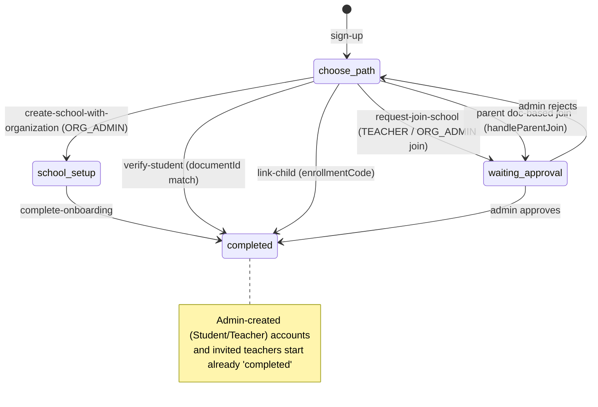

# Onboarding Analysis + README (`docs/onboarding.md`)

## Goal
Produce `docs/onboarding.md` documenting the onboarding process for the 4 non‑platform‑admin roles (`ORG_ADMIN`, `TEACHER`, `STUDENT`, `PARENT`), including the two entry paths (self‑service and admin‑created), a per‑role flow map, the `onboardingStep` state machine, and a prioritized list of pain points and improvement opportunities.

## Constraints / Handoff
- This is a documentation source file (`docs/onboarding.md`). Plan mode cannot write it directly.
- The **complete finalized content is embedded below**. An implementation‑capable agent (or the user) should create `docs/onboarding.md` with the "Document Content" section verbatim (drop the outer wrapper).
- No source code changes are part of this task — only the doc file.

## Implementation Task List
1. Create `docs/onboarding.md`.
2. Paste the content from the "Document Content" section below (everything between the `<<<BEGIN>>>` / `<<<END>>>` markers), unmodified.
3. Optionally link it from the root `README.md` under a "Documentation" heading.

## Validation
- File renders as valid GitHub‑flavored Markdown (headings, tables, mermaid block).
- Every file/line reference below resolves in the current tree.
- No code edits required; nothing to build or test.

---

## Evidence Gathered (source of truth for the doc)

### Routing / guards
- `apps/web-dashboard/src/app/dashboard.routes.ts` — public auth routes, `onboarding` route tree (`onboardingGuard`), dashboard behind `authGuard` + `onboardingCompletedGuard`, role‑specific `home` via `canMatch` guards.
- `apps/web-dashboard/src/app/auth/auth.guard.ts` — `onboardingGuard` (lines 91‑120) and `onboardingCompletedGuard` (126‑167) route on `onboardingStep`; role guards at 23‑49.
- `apps/web-dashboard/src/app/auth/auth.ts:228` — login always navigates to `/home`; the guard performs the redirect. `onboardingStep` computed at line 84.

### Self‑service onboarding UI (`apps/web-dashboard/src/app/onboarding/`)
- `choose-path.ts` — "Create school" vs "Join school".
- `create-school.ts` — ORG_ADMIN path → `POST /api/v1/auth/create-school-with-organization` → `/onboarding/setup`.
- `setup-wizard.ts` — 5 steps (school basics, degrees, study plans, courses, groups) → `POST /api/v1/auth/complete-onboarding`.
- `join-school.ts` — lists `GET /api/v1/auth/available-schools`, client‑side filter.
- `select-role.ts` — 4 role cards; STUDENT→verify-student, PARENT→verify-parent, ADMIN/TEACHER→confirm-request.
- `verify-student.ts` — `POST /api/v1/auth/request-join-school` `{ requestedRole: STUDENT, documentId }` → auto LINKED.
- `verify-parent.ts` — `POST /api/v1/auth/link-child` `{ enrollmentCode, ... }` → auto LINKED (no approval).
- `confirm-request.ts` — ADMIN/TEACHER → `request-join-school` → PENDING → `waiting-approval`.
- `waiting-approval.ts` — polls `GET /api/v1/auth/my-join-request-status` every 30s.

### Backend (`libs/auth/src/lib/`)
- `auth-session.controller.ts` — all `v1/auth/*` endpoints.
- `auth.service.ts`:
  - `signUp` (381) sets `onboardingStep: 'choose-path'`.
  - `createSchoolWithOrganization` (460) creates org + ORG_ADMIN role (all permissions) + school, sets `school-setup`.
  - `requestJoinSchool` (557) dispatch: `handleStudentJoin` (590, auto), `handleParentJoin` (652, doc‑based, **PENDING/approval**), `handleAdminTeacherJoin` (699, PENDING).
  - `linkChildByCode` (733) — enrollment‑code parent link, max 2 parents, auto `completed`.
  - `approveJoinRequest` (916) — ORG_ADMIN approves/rejects; assigns role/org/member.
  - `checkPendingInvitation` (196) / `createInvitationAccessLink` (226) / `resendUserInvitation` (280).
- `dto/request-join-school.input.ts` — `enrollmentCode` optional on the join DTO (parent path duplication).

### Admin‑created path
- `apps/dashboard-backend/src/app/students/students.service.ts:80,115,153,182` — creates User (password = documentId hash), `onboardingStep: 'completed'`, generates `enrollmentCode`, sends invitation email.
- `apps/dashboard-backend/src/app/teachers/teachers.service.ts:58,93,116` — same pattern for teachers.
- `apps/web-dashboard/src/app/admin/pages/join-requests.ts` — ORG_ADMIN approval UI.
- `apps/web-dashboard/src/app/auth/register.ts` — `pending-invitation` branch detects admin‑created accounts and routes to reset-password access link.

### `onboardingStep` state values observed
`choose-path` → `school-setup` → `completed` (ORG_ADMIN create); `waiting-approval` (teacher/admin join & doc‑based parent); `completed` (student verify, parent link-child, admin‑created accounts, invited teacher). Reject resets to `choose-path`.

---

## Document Content

> Implementation agent: write everything between the markers to `docs/onboarding.md` (remove the markers themselves).

<<<BEGIN>>>
# Skooltrak — Onboarding Process Analysis

This document maps how the four non‑platform‑admin roles get into the system, the underlying state machine, and the pain points / improvement opportunities identified in the current implementation.

Roles covered: **ORG_ADMIN**, **TEACHER**, **STUDENT**, **PARENT**.

## Two entry paths

Skooltrak has **two distinct onboarding mechanisms** that partially overlap:

1. **Self‑service** — A person registers themselves, verifies email, then either creates a school or joins an existing one and picks a role.
2. **Admin‑created (invitation)** — An `ORG_ADMIN` pre‑registers a Student/Teacher (and Parents) inside the dashboard. The account is created already `completed`; the person just sets a password via an invitation email.

Which path a person follows is **not chosen by the user** — it depends on whether an admin created their record first.

## Shared prerequisites (self‑service)

Registration is email‑first (`apps/web-dashboard/src/app/auth/register.ts`):

1. Enter email → `POST /api/v1/auth/check-pending-invitation`.
   - If an admin already created this account (unverified Student/Teacher) → **"pending invitation"** branch → `create-invitation-access-link` → redirected to reset‑password.
   - Otherwise → `POST /api/v1/auth/send-verification-link` → "check inbox".
2. Click email link → `validate-email-token` → registration form (name + password).
3. `POST /api/v1/auth/sign-up` → user created with `onboardingStep = 'choose-path'`, JWT stored → redirect to `/onboarding`.

The `onboardingCompletedGuard` (`apps/web-dashboard/src/app/auth/auth.guard.ts`) gates the dashboard and redirects based on `onboardingStep`.

## The `onboardingStep` state machine

Step values live on `User.onboardingStep`. `null`/empty is treated as completed when the user already has an `organizationId`.

## Per‑role flows

### 1. ORG_ADMIN

**Self‑service (create a school):**
1. `choose-path` → "Create a School".
2. `create-school.ts` → `POST /api/v1/auth/create-school-with-organization`.
   - Backend (`auth.service.ts:createSchoolWithOrganization`) creates the **Organization**, an **ORG_ADMIN role with ALL permissions**, the **School**, a `Member` (owner), and sets `onboardingStep = 'school-setup'`. Returns a **new JWT** (now carrying the org + permissions).
3. `setup-wizard.ts` — 5 steps: School basics → Degrees → Study plans → Courses → Groups (steps 2‑5 skippable).
4. `POST /api/v1/auth/complete-onboarding` → `onboardingStep = 'completed'` → `/home`.

**Join an existing org as ORG_ADMIN:** `select-role` → `confirm-request` → `request-join-school` → **PENDING** → an existing ORG_ADMIN approves. (Bootstrap risk: only works if the org already has an admin.)

### 2. TEACHER

**Self‑service (join):** `join-school` → `select-role` (Docente) → `confirm-request` → `request-join-school {requestedRole: TEACHER}` → `handleAdminTeacherJoin` creates a `JoinRequest (PENDING)`, sets `waiting-approval`, notifies ORG_ADMINs → `waiting-approval` page polls every 30s → admin approves in `admin/join-requests` → role/org/member assigned, `completed`.

**Admin‑created:** ORG_ADMIN creates the teacher in the dashboard (`teachers.service.ts`). User created with `onboardingStep = 'completed'`, `emailVerified = false`, password = hashed document; invitation email sent. Teacher sets password via reset link and lands directly on the dashboard.

### 3. STUDENT

**Self‑service (verify):** `join-school` → `select-role` (Estudiante) → `verify-student` (enter document ID) → `request-join-school {requestedRole: STUDENT, documentId}` → `handleStudentJoin` matches a **pre‑registered `Student` record** by `documentId + schoolId`, links `userId`, assigns STUDENT role + org + member, sets `completed`. **No admin approval.**
- Fails if no matching pre‑registered student exists ("Contacta a tu escuela").

**Admin‑created:** identical to teacher (`students.service.ts`) — account starts `completed`, invitation email, `enrollmentCode` generated (used by parents).

### 4. PARENT

**Self‑service (link a child by enrollment code) — the UI path:** `select-role` (Padre) → `verify-parent` → `POST /api/v1/auth/link-child {enrollmentCode, firstName, ...}` → `linkChildByCode` resolves Student → School → Org, enforces **max 2 parents per student**, creates/updates a per‑org `Parent` profile, adds `Member`, assigns PARENT role, sets `completed`. **No approval.** (`schoolId` from `join-school` is effectively ignored here — the code determines the school.)

**Alternate backend path (document‑based, approval required):** `handleParentJoin` matches a pre‑registered `Parent` by `documentId + organizationId`, creates a **PENDING** `JoinRequest`, notifies admins. This path is **not reachable from the current UI** (select-role never sends parents to `confirm-request`), so two contradictory parent‑join designs coexist in the backend.

## ORG_ADMIN approval loop

`admin/join-requests.ts` lists `pending-join-requests` and calls `approve-join-request`. Approval (`approveJoinRequest`) assigns role (prefers org‑specific, falls back to global, can create one), org, `Member`, links parent records for doc‑based parents, and notifies the user. Rejection resets the applicant to `choose-path`.

---

## Pain points

### Flow / UX
1. **Two overlapping onboarding systems.** Self‑service vs admin‑created diverge heavily and are easy to confuse. A student/teacher created by an admin who then tries to self‑register hits a special "pending invitation" branch — non‑obvious.
2. **Inconsistent approval model across roles.** STUDENT and PARENT self‑link **without** approval; TEACHER and joining ORG_ADMIN **require** approval. This asymmetry is undocumented and surprising (a student can self‑link with only a document number).
3. **Dead / duplicate parent path.** `handleParentJoin` (document + approval) is unreachable from the UI while `link-child` (enrollment code, no approval) is the real path. Two designs increase maintenance risk and confusion.
4. **`schoolId`/`schoolName` threaded through query params** across `join-school → select-role → verify-*`, but the parent flow ignores it (school derived from the code). Inconsistent contract.
5. **Polling instead of realtime.** `waiting-approval` polls every 30s; there's a WebSocket layer elsewhere (`chats`) that could push approval events instead.
6. **No resume/expiry semantics for `waiting-approval`.** If an admin never acts, the user is stuck; there is no reminder, escalation, or "cancel request" affordance.
7. **`select-role` shows ORG_ADMIN as a join option** even though joining as admin only works if the org already has an admin to approve it — a likely dead end / bootstrap trap.

### Security / correctness
8. **Weak default credentials for admin‑created accounts.** Password is `bcrypt(documentId)` for students/teachers (`students.service.ts:59`, `teachers.service.ts`). Document IDs are low‑entropy and often known — anyone who knows the document could log in before the invite is used.
9. **Student self‑verify relies only on `documentId + schoolId`.** No secondary factor; a known document number links an account. Consider a per‑student code (students already have `enrollmentCode`).
10. **Enrollment code strength / rotation.** Parents link with `enrollmentCode`; there is a `enrollmentCodeGeneratedAt` field but no visible expiry/rotation policy or rate limiting on `link-child`/`verify-student` attempts (brute‑force surface).
11. **`available-schools` exposes every school** (name, org, city, student count) to any authenticated user with no filtering/scoping — information disclosure for a multi‑tenant platform.

### State machine / data integrity
12. **`onboardingStep` is a free‑form string** with values scattered across the codebase (`choose-path`, `school-setup`, `waiting-approval`, `completed`, `null`, `''`). No enum/type; guards special‑case `null`/empty. Easy to drift.
13. **Reject resets to `choose-path` but leaves the stale `JoinRequest`** (`REJECTED`); `getMyJoinRequestStatus` returns the latest, so re‑applying UX around historical requests is fragile.
14. **ORG_ADMIN via create gets ALL permissions by connecting every `Permission`.** New permissions added later are not auto‑granted to existing org admins (role snapshot at creation).

### Observability / support
15. **Email failures are swallowed** (logged, not surfaced) during admin creation, so a teacher/student may never receive an invite and no one is alerted.
16. **No audit trail** for who approved/rejected join requests beyond notification side effects.

---

## Improvement opportunities

Prioritized, high‑impact first.

| # | Opportunity | Addresses | Effort signal |
|---|-------------|-----------|---------------|
| 1 | Replace default `documentId` password with a random token + forced set‑password on first login (invite link only). | Pain 8 | Backend + email |
| 2 | Introduce a typed `OnboardingStep` enum shared across backend/frontend; centralize transitions in one service. | Pain 12 | Refactor |
| 3 | Add rate limiting + attempt logging to `verify-student`, `link-child`, `request-join-school`. Add code expiry/rotation for `enrollmentCode`. | Pain 9, 10 | Backend |
| 4 | Remove the dead `handleParentJoin` path (or wire it intentionally) and unify the parent contract; stop threading `schoolId` when unused. | Pain 3, 4 | Cleanup |
| 5 | Scope `available-schools` (e.g., search‑only, require min query length, hide counts) to reduce tenant disclosure. | Pain 11 | Backend |
| 6 | Make the approval model explicit and consistent; document which roles need approval and add an admin‑configurable toggle per role. | Pain 2 | Product + backend |
| 7 | Push approval/rejection over the existing WebSocket channel; keep polling as fallback. Add "cancel request" and admin reminders. | Pain 5, 6 | Frontend + WS |
| 8 | Surface email‑send failures to admins (status badge on the created user, retry action) instead of silent logs. | Pain 15 | Full‑stack |
| 9 | Hide/guard ORG_ADMIN as a join option unless the target org can actually approve; clarify the "create vs join" distinction. | Pain 7 | Frontend |
| 10 | Grant ORG_ADMIN permissions via a role→"all permissions" resolver at check time (or migration) so new permissions propagate. | Pain 14 | Backend |
| 11 | Add an onboarding audit log (who/what/when for approvals, links, rejections). | Pain 16 | Backend |
| 12 | Write end‑to‑end onboarding tests per role covering both entry paths and the reject→retry loop. | Regression safety | Tests |

## Key source references

- Routing/guards: `apps/web-dashboard/src/app/dashboard.routes.ts`, `apps/web-dashboard/src/app/auth/auth.guard.ts`
- Self‑service UI: `apps/web-dashboard/src/app/onboarding/*` (`choose-path`, `create-school`, `setup-wizard`, `join-school`, `select-role`, `verify-student`, `verify-parent`, `confirm-request`, `waiting-approval`)
- Registration: `apps/web-dashboard/src/app/auth/register.ts`
- Backend orchestration: `libs/auth/src/lib/auth.service.ts`, `libs/auth/src/lib/auth-session.controller.ts`
- Admin‑created accounts: `apps/dashboard-backend/src/app/students/students.service.ts`, `apps/dashboard-backend/src/app/teachers/teachers.service.ts`
- Admin approval UI: `apps/web-dashboard/src/app/admin/pages/join-requests.ts`
<<<END>>>

## Open questions (none blocking)
- Root `README.md` link to `docs/onboarding.md` — include or not (nice‑to‑have; agent may add under a Documentation heading).
