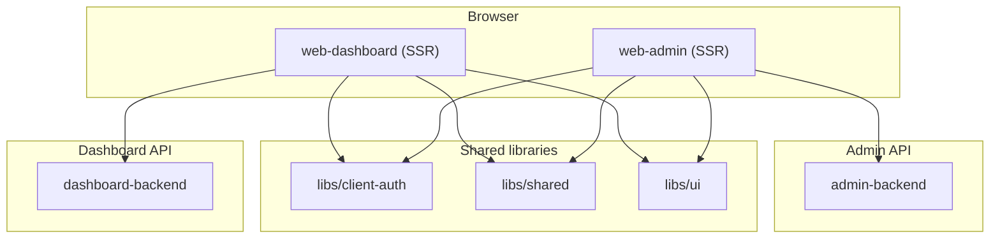
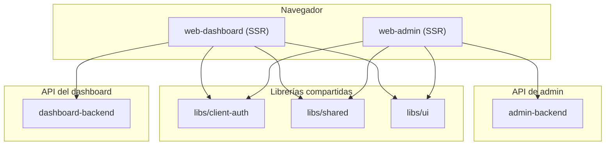

# Skooltrak Platform

<p align="center">
  
  
</p>

Monorepo managed with Nx containing Angular frontends and NestJS backends.

## Purpose

Skooltrak is an educational platform for schools to manage academic processes, users, and communication across dashboards and admin tools.

## Architecture

Two standalone Angular frontends consume two NestJS backends. The **web-dashboard** app covers the school dashboard (auth, onboarding, classes, chats, and the public store under `/store/...`), and **web-admin** is the separate admin console.



**Runtime behavior**

- **web-dashboard** is an Angular SSR app that owns the school dashboard, onboarding flows, authenticated features, and the school store (`/store` directory + `/store/:schoolSlug/...` catalog, cart, checkout, and admin pages). It talks to `dashboard-backend` for both authenticated and public store APIs.
- **web-admin** + **admin-backend** are deployed and developed independently of the dashboard.
- **libs/client-auth** centralizes browser token/session helpers and the HTTP bearer interceptor.

**Local development ports**

| Process           | Port                     |
| ----------------- | ------------------------ |
| web-dashboard     | 4200                     |
| web-admin         | 4300                     |
| dashboard-backend | 3000                     |
| admin-backend     | (see app config / proxy) |

Use `bun run serve:dev` to start the dashboard + its backend, or `bun run serve:dev:admin` for the admin stack.

## Apps

- **web-dashboard** — Angular SSR app: school dashboard, onboarding, authenticated features, public school store
- **web-admin** — Angular SSR admin app
- **dashboard-backend** — NestJS REST/OpenAPI API (school platform + public store endpoints)
- **admin-backend** — NestJS REST/OpenAPI API for admin

E2E projects are colocated under `apps/*-e2e`.

## Getting started

- **Install dependencies**
  ```sh
  bun install
  ```

- **Environment**
  - Copy `.env` and set required variables for web and backend apps.

## Development

- **Start dashboard + dashboard API**

  ```sh
  bun run serve:dev
  ```

- **Start admin (web + api)**

  ```sh
  bun run serve:dev:admin
  ```

- **Serve a single project**

  ```sh
  bunx nx serve web-dashboard
  bunx nx serve dashboard-backend
  bunx nx serve web-admin
  bunx nx serve admin-backend
  ```

- **Build**

  ```sh
  bunx nx build <project-name>
  ```

- **Project info / graph**
  ```sh
  bunx nx show project <project-name>
  bunx nx graph
  ```

## Testing & Linting

- **Unit tests (Vitest/Jest as configured by project)**
  ```sh
  bunx nx test <project-name>
  ```
- **E2E (Playwright)**
  ```sh
  bunx nx e2e <e2e-project>
  ```
- **Lint**
  ```sh
  bunx nx lint <project-name>
  ```

## Tech stack

- **Nx 22** for monorepo orchestration
- **Angular 21** for frontends (application builder + SSR)
- **NestJS 11** for APIs (REST + OpenAPI/Swagger, Socket.IO for live chat)
- **Prisma 7** for database access
- **Tailwind CSS 4** + **DaisyUI** for styling

## Project structure

- **apps/** — application projects (frontends, backends, e2e)
- **libs/** — shared libraries (`client-auth`, `shared`, `ui`, `auth`, …)
- **prisma/** — Prisma schema and assets
- **generated/** — generated artifacts (e.g., Prisma client)

Use `bunx nx g` to generate code (apps, libs, components, etc.).

## Documentation

- [Onboarding process analysis](docs/onboarding.md) — role onboarding flows (ORG_ADMIN, TEACHER, STUDENT, PARENT), state machine, pain points, and improvement opportunities.

---

## Español

# Plataforma Skooltrak

<p align="center">
  
  
</p>

Monorepo gestionado con Nx que contiene frontends en Angular y backends en NestJS.

## Propósito

Skooltrak es una plataforma educativa para escuelas que permite gestionar procesos académicos, usuarios y comunicación mediante paneles y herramientas de administración.

## Arquitectura

Dos frontends Angular independientes consumen dos backends NestJS. **web-dashboard** cubre el panel escolar (auth, onboarding, clases, chats y la tienda pública en `/store/...`) y **web-admin** es el panel de administración separado.



**Comportamiento**

- **web-dashboard** es una app Angular con SSR que aloja el panel escolar, onboarding, funciones autenticadas y la tienda escolar pública (`/store` y `/store/:schoolSlug/...`).
- **web-admin** + **admin-backend** se desarrollan y despliegan aparte del dashboard.
- **libs/client-auth** concentra token/sesión en el navegador y el interceptor HTTP Bearer.

**Puertos locales de desarrollo**

| Proceso           | Puerto               |
| ----------------- | -------------------- |
| web-dashboard     | 4200                 |
| web-admin         | 4300                 |
| dashboard-backend | 3000                 |
| admin-backend     | (ver proxy / config) |

Usa `bun run serve:dev` para arrancar el dashboard + backend, o `bun run serve:dev:admin` para el stack de admin.

## Aplicaciones

- **web-dashboard** — App Angular SSR: panel escolar, onboarding, funciones autenticadas y tienda escolar pública
- **web-admin** — Panel admin Angular SSR
- **dashboard-backend** — API NestJS REST/OpenAPI (plataforma escolar + endpoints públicos de tienda)
- **admin-backend** — API NestJS REST/OpenAPI para admin

Los proyectos E2E están en `apps/*-e2e`.

## Comenzando

- **Instalar dependencias**
  ```sh
  bun install
  ```

- **Entorno**
  - Copia `.env` y define las variables requeridas para web y backend.

## Desarrollo

- **Iniciar dashboard + API del dashboard**

  ```sh
  bun run serve:dev
  ```

- **Iniciar admin (web + api)**

  ```sh
  bun run serve:dev:admin
  ```

- **Servir un proyecto específico**

  ```sh
  bunx nx serve web-dashboard
  bunx nx serve dashboard-backend
  bunx nx serve web-admin
  bunx nx serve admin-backend
  ```

- **Build**

  ```sh
  bunx nx build <nombre-proyecto>
  ```

- **Información / grafo del proyecto**
  ```sh
  bunx nx show project <nombre-proyecto>
  bunx nx graph
  ```

## Pruebas y Linting

- **Unitarias (Vitest/Jest según el proyecto)**
  ```sh
  bunx nx test <nombre-proyecto>
  ```
- **E2E (Playwright)**
  ```sh
  bunx nx e2e <proyecto-e2e>
  ```
- **Lint**
  ```sh
  bunx nx lint <nombre-proyecto>
  ```

## Tecnologías

- **Nx 22** para orquestación de monorepo
- **Angular 21** para frontends (application builder + SSR)
- **NestJS 11** para APIs (REST + OpenAPI/Swagger, Socket.IO para chat en vivo)
- **Prisma 7** para acceso a base de datos
- **Tailwind CSS 4** + **DaisyUI** para estilos

## Estructura del proyecto

- **apps/** — aplicaciones (frontends, backends, e2e)
- **libs/** — librerías compartidas (`client-auth`, `shared`, `ui`, `auth`, …)
- **prisma/** — esquema y recursos de Prisma
- **generated/** — artefactos generados (p.ej., Prisma client)

Usa `bunx nx g` para generar código (apps, libs, componentes, etc.).
