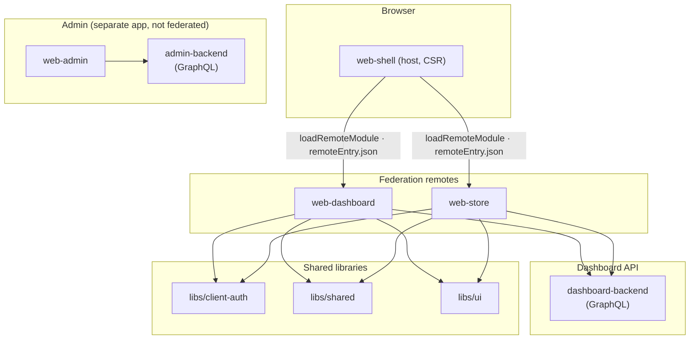
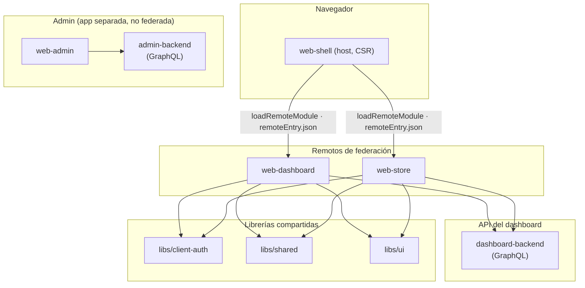

# Skooltrak Platform

<p align="center">
  
  
</p>

Monorepo managed with Nx containing Angular frontends and NestJS GraphQL backends.

## Purpose

Skooltrak is an educational platform for schools to manage academic processes, users, and communication across dashboards and admin tools.

## Architecture

The **school dashboard and public store** are composed with **Native Federation** (Angular). A thin **shell** host loads **web-dashboard** and **web-store** as remotes at runtime. The **admin** app stays a standalone Angular app and is **not** part of the federation graph.



**Runtime behavior**

- **web-shell** owns top-level routing and federation bootstrap (`initFederation`, `federation.manifest.json`). It is client-rendered only (no SSR on the host).
- **web-dashboard** exposes dashboard routes as a remote (for example `./routes`) and talks to `dashboard-backend` for authenticated GraphQL.
- **web-store** exposes store routes as a remote and can also run **standalone** (for example `/store/:schoolSlug`) with public catalog queries where applicable.
- **libs/client-auth** centralizes browser token/session helpers and Apollo bearer behavior shared by dashboard and store.
- **web-admin** + **admin-backend** are deployed and developed independently of the shell/remotes.

**Local development ports** (see `apps/web-shell/public/federation.manifest.json`)

| Process            | Port |
| ------------------ | ---- |
| web-shell (host)   | 4200 |
| web-store (remote) | 4201 |
| web-dashboard      | 4202 |
| dashboard-backend  | (see app config / proxy) |

Use `bun run serve:dev` so Nx starts the shell and its **dependsOn** targets (backend + remotes). If you run **only** `nx serve web-shell` without those processes, the browser cannot load `remoteEntry.json` from 4201/4202.

## Apps

- **web-shell** — Angular federation **host** (loads dashboard + store remotes)
- **web-dashboard** — Angular **remote**: school dashboard, onboarding, authenticated features
- **web-store** — Angular **remote**: school store; also runnable standalone with slug-based school context
- **dashboard-backend** — NestJS GraphQL API (school platform + public store queries)
- **web-admin** — Angular admin app (not federated)
- **admin-backend** — NestJS GraphQL API for admin

E2E projects are colocated under `apps/*-e2e`.

## Getting started

- **Install dependencies**
  - Using Bun (preferred, bun.lock present):
    ```sh
    bun install
    ```
  - Or npm:
    ```sh
    npm install
    ```
  - Or pnpm:
    ```sh
    pnpm install
    ```

- **Environment**
  - Copy `.env` and set required variables for web and backend apps.

## Development

- **Start shell + dashboard API + remotes** (recommended for the main product)
  ```sh
  bun run serve:dev
  ```
  This runs `nx run web-shell:serve`, which pulls up `dashboard-backend`, `web-dashboard`, and `web-store` so federation URLs in `federation.manifest.json` resolve.

- **Start Admin (web + api)**
  ```sh
  bun run serve:dev:admin
  ```

- **Serve a single project** (for example debugging one app; for the shell you usually still need remotes on 4201/4202)
  ```sh
  bunx nx serve web-shell
  bunx nx serve web-dashboard
  bunx nx serve web-store
  bunx nx serve dashboard-backend
  bunx nx serve web-admin
  bunx nx serve admin-backend
  ```

- **Build**
  ```sh
  bunx nx build <project-name>
  ```

- **Project info / graph**
  ```sh
  bunx nx show project <project-name>
  bunx nx graph
  ```

## Testing & Linting

- **Unit tests (Vitest/Jest as configured by project)**
  ```sh
  bunx nx test <project-name>
  ```
- **E2E (Playwright)**
  ```sh
  bunx nx e2e <e2e-project>
  ```
- **Lint**
  ```sh
  bunx nx lint <project-name>
  ```

## Tech stack

- **Nx 22** for monorepo orchestration
- **Angular 21** for frontends (application builder; **Native Federation** for shell/remotes)
- **NestJS 11** for APIs
- **GraphQL 16** with Apollo
- **Prisma 7** for database access
- **Tailwind CSS 4** + **DaisyUI** for styling

## Project structure

- **apps/** — application projects (frontends, backends, e2e)
- **libs/** — shared libraries (`client-auth`, `shared`, `ui`, `auth`, …)
- **prisma/** — Prisma schema and assets
- **generated/** — generated artifacts (e.g., Prisma client)

Use `bunx nx g` to generate code (apps, libs, components, etc.).

---

## Español

# Plataforma Skooltrak

<p align="center">
  
  
</p>

Monorepo gestionado con Nx que contiene frontends en Angular y backends GraphQL en NestJS.

## Propósito

Skooltrak es una plataforma educativa para escuelas que permite gestionar procesos académicos, usuarios y comunicación mediante paneles y herramientas de administración.

## Arquitectura

El **panel escolar y la tienda pública** se componen con **Native Federation** (Angular). Un **shell** delgado carga **web-dashboard** y **web-store** como remotos en tiempo de ejecución. La aplicación **admin** sigue siendo Angular independiente y **no** forma parte del grafo de federación.



**Comportamiento**

- **web-shell** define el enrutado de alto nivel y el arranque de federación (`initFederation`, `federation.manifest.json`). Solo renderizado en cliente (sin SSR en el host).
- **web-dashboard** expone rutas del panel como remoto y usa `dashboard-backend` para GraphQL autenticado.
- **web-store** expone rutas de tienda como remoto y también puede ejecutarse **solo** (por ejemplo `/store/:schoolSlug`) con consultas públicas cuando aplique.
- **libs/client-auth** concentra token/sesión en el navegador y Apollo compartido entre dashboard y tienda.
- **web-admin** + **admin-backend** se desarrollan y despliegan aparte del shell/remotos.

**Puertos locales de desarrollo** (ver `apps/web-shell/public/federation.manifest.json`)

| Proceso            | Puerto |
| ------------------ | ------ |
| web-shell (host)   | 4200   |
| web-store (remoto) | 4201   |
| web-dashboard      | 4202   |
| dashboard-backend  | (ver proxy / config) |

Usa `bun run serve:dev` para que Nx levante el shell y sus **dependsOn** (API + remotos). Si solo ejecutas el shell sin esos procesos, el navegador no podrá cargar `remoteEntry.json` en 4201/4202.

## Aplicaciones

- **web-shell** — **Host** de federación Angular (carga remotos dashboard + tienda)
- **web-dashboard** — **Remoto** Angular: panel escolar, onboarding, funciones autenticadas
- **web-store** — **Remoto** Angular: tienda; también en modo standalone con contexto por slug
- **dashboard-backend** — API GraphQL NestJS (plataforma escolar + consultas públicas de tienda)
- **web-admin** — Admin Angular (no federada)
- **admin-backend** — API GraphQL NestJS para admin

Los proyectos E2E están en `apps/*-e2e`.

## Comenzando

- **Instalar dependencias**
  - Con Bun (preferido, hay bun.lock):
    ```sh
    bun install
    ```
  - O npm:
    ```sh
    npm install
    ```
  - O pnpm:
    ```sh
    pnpm install
    ```

- **Entorno**
  - Copia `.env` y define las variables requeridas para web y backend.

## Desarrollo

- **Iniciar shell + API del dashboard + remotos** (recomendado para el producto principal)
  ```sh
  bun run serve:dev
  ```
  Ejecuta `nx run web-shell:serve` y arranca `dashboard-backend`, `web-dashboard` y `web-store` para que las URLs de federación funcionen.

- **Iniciar Admin (web + api)**
  ```sh
  bun run serve:dev:admin
  ```

- **Servir un proyecto específico**
  ```sh
  bunx nx serve web-shell
  bunx nx serve web-dashboard
  bunx nx serve web-store
  bunx nx serve dashboard-backend
  bunx nx serve web-admin
  bunx nx serve admin-backend
  ```

- **Build**
  ```sh
  bunx nx build <nombre-proyecto>
  ```

- **Información / grafo del proyecto**
  ```sh
  bunx nx show project <nombre-proyecto>
  bunx nx graph
  ```

## Pruebas y Linting

- **Unitarias (Vitest/Jest según el proyecto)**
  ```sh
  bunx nx test <nombre-proyecto>
  ```
- **E2E (Playwright)**
  ```sh
  bunx nx e2e <proyecto-e2e>
  ```
- **Lint**
  ```sh
  bunx nx lint <nombre-proyecto>
  ```

## Tecnologías

- **Nx 22** para orquestación de monorepo
- **Angular 21** para frontends (application builder; **Native Federation** en shell/remotos)
- **NestJS 11** para APIs
- **GraphQL 16** con Apollo
- **Prisma 7** para acceso a base de datos
- **Tailwind CSS 4** + **DaisyUI** para estilos

## Estructura del proyecto

- **apps/** — aplicaciones (frontends, backends, e2e)
- **libs/** — librerías compartidas (`client-auth`, `shared`, `ui`, `auth`, …)
- **prisma/** — esquema y recursos de Prisma
- **generated/** — artefactos generados (p.ej., Prisma client)

Usa `bunx nx g` para generar código (apps, libs, componentes, etc.).
